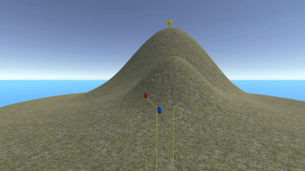

# Reaching Global Maximum
Simulations of life-like agents with limited eyesights moving on a complex landscape with the objective to reach the highest point of the landscape. The simulation tests several learing algorthims visually in an interacive and educational way to shawcase reaching the global maximum (Unity 3D framework). 

# Video Explanation:
https://youtu.be/1p11-oggW1E

# Play with the simulation here:
- Online: https://simmer.io/@hunar/reaching-global-maxima
- Or download the binaries: https://github.com/hunar4321/find-global-maximum/releases/tag/v.0.1.0

 

**ScreenShots**

 

**Liberal vs Conservative**

 

Life as an optimization problem using simple simulations. We know that DNA based life replicates and reproduces exponentially but because of resource limitations it will hit a ceiling and due to the internal struggle it optimizes itself for surviving better, hence, the survival of the fittest is becoming the objective of life.
The purpose of this simulation is not to present the state-of-the-art algorithms but to bridge and link the terms that are used in the Machine Learning world and the ones that are used in the biological and the political world by making these toy simulations and easily digestible videos to both parties. I believe the Machine learning world can give so much to the other fields because life in essence is a survival optimization problem where everything is complicated by being stuck at a Local Maximum.
Important Note:
Some experts say that Local Maxima doesn't matter in very high dimensional landscapes. This is true if the convergence speed doesn't matter and also if all dimensions have equal weights. However, we know that is not the case, convergence speed always matters in a competitive world like ours as all Life forms are in a tough race for survival. Also, not all dimensions have the same impactful weight. Many dimensions can be ignored or they are already pruned or not accessible, therefore, the actual number of the plausible dimensions is much less than the available dimensions.

Website: https://www.brainxyz.com/

Your objective is to help the characters to reach the Global Maximum by elevating the water levels (to simulate threat) and also by making the characters reproduce by pressing the space button (max number is 300).
Controllers:
WASD to move the camera,
Left mouse to elevate the water level,
Right mouse to lower the water level

Other related Algorithms: Neat algorithm, Hill Climbing, Particle swarm optimization...,etc. 
Other Optimization techniques that uses Calculus: Gradient Descent, Adam, Recursive Least Squares…, etc.
Other related terms: Local minimum & Global minimum (when minimizing the error)
Deep Learning techniques are good to avoid being stuck at local maximum as they use many layers and lots of data.
Other learning methods: Hebbian Learning, Winner takes it all (WTA), …etc. 
We at Brainxyz use: Predictive Hebbian Unified Neurons (PHUN)
